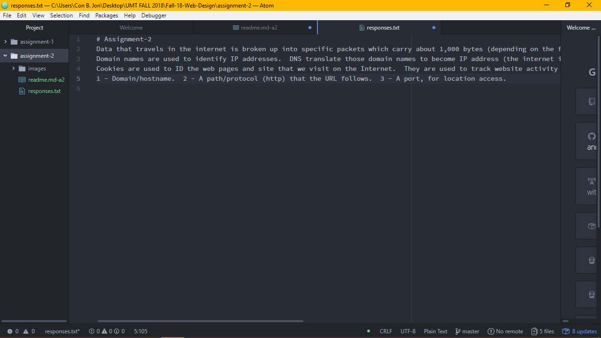

# Technical Report

A version control system is used for computer files.  It records changes that are done to these files so it is possible to retrieve specific versions.  VCS is beneficial for our class so we can manage our coding thoroughly.  It gives us the ability to go back and make changes to previously saved codes and files.

[Link to my responses](./responses.txt)

